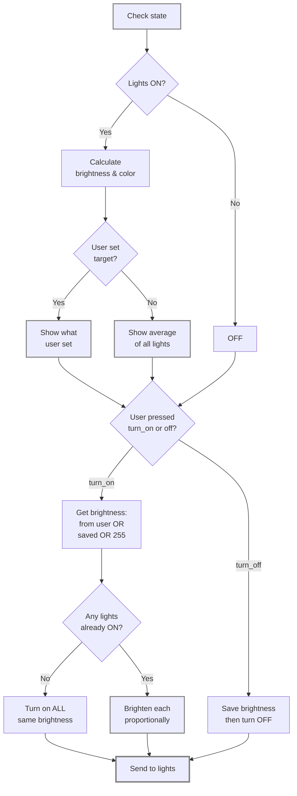

# Proportional Light

> A Home Assistant custom component that makes managing your lights more natural. Works just like Apple Music's multi-room controls.

https://github.com/user-attachments/assets/97c36751-1fad-479d-8a93-48fb866bdf43

## Features

- **Proportional Brightness**: Maintain natural brightness relationships between lights while scaling the group.
- **Hue Offsets**: Add personality to your lights with per-light hue adjustments.

## Quick Setup

Install via HACS (recommended)

1. In Home Assistant open HACS.
2. Click the three-dots menu (top right) -> "Custom repositories".
3. In the "Add repository" dialog paste the repository URL:

	```bash
    https://github.com/max-scopp/hass_proportional_light
    ```

	Choose Category: "Integration" and click "Add".
4. In HACS go to "Integrations" and search for "Proportional Light". Click "Install".
5. After installation restart Home Assistant.

Add the integration

1. In Home Assistant go to Settings -> Devices & Services -> Add Integration.
2. Search for "Proportional Light" and follow the on-screen steps.
3. Add the lights you want to manage and optionally set per-light hue offsets (-180° to +180°).

Manual install (alternative)

1. Copy the `proportional_light` folder into your `custom_components` directory.
2. Restart Home Assistant.
3. Add the integration from Settings -> Devices & Services as above.

## How It Works


