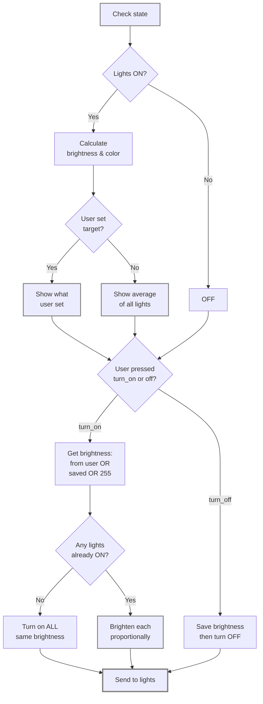

# Proportional Light

> A Home Assistant custom component that makes managing your lights more natural. Works just like Apple Music's multi-room controls.

https://github.com/user-attachments/assets/97c36751-1fad-479d-8a93-48fb866bdf43

## Features

- **Proportional Brightness**: Maintain natural brightness relationships between lights while scaling the group.
- **Hue Offsets**: Add personality to your lights with per-light hue adjustments (-180° to +180°).
- **Color Averaging**: Automatically averages colors and temperatures from all member lights.
- **Smart Brightness Proportions**: 
  - Keeps natural brightness relationships when you toggle lights on/off
  - Works seamlessly with automation (e.g., Ambient Light) to reset proportions when needed
  - Configurable reset modes to suit your workflow
- **Default Proportions**: Optionally set fallback brightness proportions that apply when custom proportions have timed out
- **Adaptive Lighting Compatible**: Fully supports Home Assistant's adaptive_lighting integration.
- **YAML-free Configuration**: User-friendly UI for setup without editing YAML files.

## Quick Setup

Install via HACS (recommended)

1. In Home Assistant open HACS.
2. Click the three-dots menu (top right) -> "Custom repositories".
3. In the "Add repository" dialog paste the repository URL:

	```bash
    https://github.com/max-scopp/hass_proportional_light
    ```

	Choose Category: "Integration" and click "Add".
4. In HACS go to "Integrations" and search for "Proportional Light". Click "Install".
5. After installation restart Home Assistant.

Add the integration

1. In Home Assistant go to Settings -> Devices & Services -> Add Integration.
2. Search for "Proportional Light" and follow the on-screen steps.
3. Add the lights you want to manage and optionally set per-light hue offsets (-180° to +180°).

Manual install (alternative)

1. Copy the `proportional_light` folder into your `custom_components` directory.
2. Restart Home Assistant.
3. Add the integration from Settings -> Devices & Services as above.

## Configuration

After adding the integration, you can configure it via the Options menu:

### Brightness Proportions Reset

Control how brightness proportions are managed:

- **Never reset**: Keeps proportions indefinitely (good for manual light groups)
- **Reset on turn off**: Clears proportions when the group is turned off
- **Reset when turned on with specific brightness**: Only resets when turned on with an explicit brightness (e.g., from Ambient Light automation)
- **Reset on both**: Combination of the above

### Reset Timeout

When lights are off, automatically reset proportions after a specified duration (default: 8 hours).

Set to `0` to disable timeout-based resets. This is useful when combined with "Reset when turned on with specific brightness" to allow proportions to persist across short off periods but reset after extended downtime.

### Default Proportions (Optional)

Set fallback brightness proportions that apply when custom proportions have timed out. These serve as a baseline when you've turned lights off for an extended period:

- **Example**: Light A at 100%, Light B at 50% means Light A is always twice as bright as Light B
- **Use case**: Ensure consistent lighting when automation like Ambient Light resets proportions after timeout
- **Behavior**: Leave all at default to use dynamic proportions exclusively (learns from manual adjustments)

**Workflow with Ambient Light + Default Proportions**:
1. Set Reset mode to "Reset when turned on with specific brightness"
2. Configure Default Proportions (e.g., 80%, 60%, 40% for three lights)
3. When Ambient Light turns on lights at specific brightness → proportions reset then apply default fallback values
4. When you manually toggle lights → proportions evolve naturally

### Hue Offsets

Add per-light color adjustments (-180° to +180°) to fine-tune the group's average color.

## How It Works


